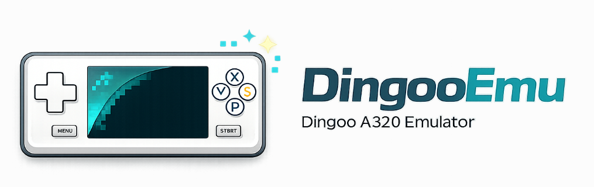

# DingooEmu — A Dingoo A320 and Gemei A330 emulator written in Rust

<p align="center">
  
</p>

<p align="center">
  <a href="https://AloysHF.github.io/DingooEmu/"></a>
  <a href="https://github.com/AloysHF/DingooEmu/actions/workflows/ci.yml"></a>
  <a href="https://git.libretro.com/libretro/dingooemu/-/pipelines"></a>
  <a href="https://github.com/AloysHF/DingooEmu/releases/latest"></a>
  <a href="https://github.com/AloysHF/DingooEmu/releases"></a>
  <a href="https://sonarcloud.io/dashboard?id=AloysHF_DingooEmu"></a>
  <a href="LICENSE"></a>
  <a href="https://discord.gg/7XDdSrYD"></a>
  <a href="https://qm.qq.com/q/LAO7DKAWUC"></a>
</p>

DingooEmu runs native software for the Dingoo A320 and Gemei A330 handhelds.
It selects an isolated MIPS32 or ARM32/Thumb runtime after validating the
content container, then provides the matching device memory and SDK services.

| Device generation | Native content | Guest CPU |
|---|---|---|
| Dingoo A320 | `.app` | MIPS32 |
| Gemei A330 firmware 1.0 | `.cc` | ARM32/Thumb |
| Later Gemei A330 firmware, 2D software | `.c2s` | ARM32/Thumb |
| Later Gemei A330 firmware, 3D software | `.c3s` | ARM32/Thumb |

The extension is not trusted on its own: the package layout, load address,
and guest architecture must agree before content is loaded.

## Features

- **Two guest architectures** — Cached MIPS32 interpretation for A320 software and a pure Rust ARM32/Thumb interpreter with ARMv5TE fixed-point multiply support for A330 software
- **Optional MIPS JIT** — Native translation of hot A320 blocks on 64-bit Android; A330 content always uses the ARM interpreter
- **Real-time scheduling** — Guest timing stays at 60 Hz without requiring one host-side dispatch per hardware clock cycle
- **HLE (High-Level Emulation)** — Architecture-specific SDK bridges for graphics, input, audio, timing, files, resources, tasks, and synchronization
- **Auditable compatibility diagnostics** — Aggregate unknown SDK calls and emit per-game JSON reports for review
- **Multi-format loading** — Validated `.app`, `.cc`, `.c2s`, and `.c3s` CCDL packages with automatic runtime selection
- **Frame rendering** — Native 320×240 RGB565 framebuffer output
- **PCM audio output** — Dingoo waveout playback with format conversion, volume, and resampling
- **Screenshot mode** — Headless frame capture for automated testing and preview generation
- **Batch screenshot** — Process multiple `.app` files with `scripts/batch-screenshots.ps1`
- **RetroArch integration** — libretro core with video, asynchronous audio delivery, RetroPad input, reset, persistent files, save states, cheats, and memory access
- **Cross-platform** — Windows, Linux, macOS

## Usage

### Standalone Mode

Download the latest binary from the
[Releases](https://github.com/AloysHF/DingooEmu/releases) page and run:

```bash
dingoo-emu path/to/game.app
# or: dingoo-emu path/to/game.c2s
```

See the [Standalone Emulator](docs/Standalone-Emulator.md) guide for
installation, keyboard controls, screenshot mode, and all command-line options.

### RetroArch Mode

<!-- TODO: Publish DingooEmu in the official RetroArch Core Downloader index. -->

Install **Dingoo A320 / Gemei A330 (DingooEmu)** from RetroArch's Core
Downloader, or install the release files manually, then load an `.app`, `.cc`,
`.c2s`, or `.c3s` file through
**Load Content**.

See the [RetroArch Core](docs/RetroArch-Core.md) guide for installation,
supported platforms and features, RetroPad mapping, core options, and cheats.

## Building

Requires [Rust](https://www.rust-lang.org/tools/install) (stable).

### Standalone Mode (Default)

```bash
cargo build -p dingooemu --release
cargo run -p dingooemu --release -- path/to/game.app
cargo run -p dingooemu --release -- --fullscreen path/to/game.c3s
```

The binary is produced at `target/release/dingoo-emu` (`dingoo-emu.exe` on
Windows).

### Libretro Core (for RetroArch)

```bash
cargo build -p dingooemu-libretro --release
```

Cargo names the cdylib after its lib target, so this produces `dingooemu.dll`
on Windows, `libdingooemu.so` on Linux, or `libdingooemu.dylib` on macOS under
`target/release/`. Rename it to `dingooemu_libretro.<ext>` before copying it
into RetroArch's `cores/` directory.

For Android cross-compilation, see
[Android Libretro Core](docs/Android-Libretro-Core.md). For iOS, see
[iOS Libretro Core](docs/iOS-Libretro-Core.md).

## Testing

Run the unit tests:

```bash
cargo test --workspace
```

## Architecture

```
crates/
├── dingooemu-core/              # Platform-independent emulator engine (library)
│   └── src/
│       ├── lib.rs               # Crate root (module declarations)
│       ├── runtime.rs           # Format-neutral runtime facade
│       ├── content.rs           # Content format and architecture detection
│       ├── app_loader.rs        # Shared CCDL package parser
│       ├── emulator.rs          # Dingoo A320 APP/MIPS runtime
│       ├── emulator/
│       │   └── sdk_hle/         # A320 SDK dispatch and implementations
│       │       ├── mod.rs       # Single HLE dispatcher
│       │       ├── graphics.rs  # LCD and framebuffer calls
│       │       ├── gui.rs       # Focused-window key message dispatch
│       │       ├── input.rs     # Buttons and input events
│       │       ├── audio.rs     # PCM and wave output
│       │       ├── files.rs     # Resources, files, and saves
│       │       ├── tasks.rs     # Tasks and semaphores
│       │       └── system.rs    # Memory, timing, and system calls
│       ├── cpu.rs               # Cached-block MIPS32 CPU interpreter
│       ├── jit.rs               # Optional native translator for hot MIPS32 blocks
│       ├── memory.rs            # A320 memory bus
│       ├── a330_runtime.rs      # A330 lifecycle, scheduler, and SDK bridge
│       ├── arm_cpu.rs           # ARM32/Thumb interpreter
│       ├── a330_memory.rs       # A330 memory map and package loader
│       ├── save_state.rs        # Versioned compressed state container
│       ├── video.rs             # Framebuffer and screen rendering
│       ├── audio.rs             # Audio engine (PCM output)
│       ├── input.rs             # Button state management
│       └── error.rs             # Error types
├── dingooemu/                   # Standalone binary (-> dingoo-emu)
│   └── src/
│       └── main.rs              # Window loop and CLI front-end
└── dingooemu-libretro/          # libretro cdylib (-> dingooemu_libretro.{dll,so,dylib})
    ├── dingooemu_libretro.info  # RetroArch core metadata
    └── src/
        ├── lib.rs               # cdylib crate root
        ├── api.rs               # Exported libretro functions
        ├── callbacks.rs         # Callback management
        └── types.rs             # libretro type definitions
```

## Game Compatibility

Compatibility results are experimental and cover startup and initial rendering
only. The published matrix currently covers A320 APP software; A330 support is
new and should not be interpreted as universal game compatibility. See
[Game Compatibility](docs/Game-Compatibility.md) for the current results and
screenshots.

## Keyboard Controls

| Key | Dingoo Button |
|-----|---------------|
| Arrow keys | D-pad |
| X | A |
| Z | B |
| S | X |
| A | Y |
| Enter | START |
| Right Shift | SELECT |
| Q | L shoulder |
| W | R shoulder |
| Esc | Exit |

The standalone defaults match RetroArch's standard keyboard bindings for the
equivalent RetroPad buttons.

## Contribute

Contributions are welcome! Whether you're interested in fixing bugs, adding features, improving documentation, or testing game compatibility, we'd love your help. See [CONTRIBUTING.md](docs/CONTRIBUTING.md) for details.

## License

This project is licensed under the [BSD 3-Clause License](LICENSE).
JIT-enabled Android binaries also contain compatible third-party components;
their complete terms are included in [THIRD_PARTY_LICENSES.md](THIRD_PARTY_LICENSES.md).
