# Game Compatibility

Compatibility is still experimental. The results below describe the exact
scenario that has been verified and do not imply complete gameplay support.

The current deduplicated sample set contains 32 games. On August 1, 2026, a
release batch produced unified JSON and CSV results with 32/32 L0 passes and
32/32 L1 passes. L0 means the content loaded and emitted valid diagnostics for
the requested capture. L1 additionally means every requested frame completed,
a screenshot was produced, and the RGB565 framebuffer was neither black nor a
single solid color. Twelve representative games also pass L2: versioned per-frame
button scripts reach exact RGB565 framebuffer CRC32 checkpoints that differ
from same-frame no-input controls. Five of those games pass L3 by matching an
exact non-silent guest PCM stream, its declared format, and bounded virtual
queue behavior without rejected writes or underflow. Sword and Fairy uses a 1200-frame capture
override because its startup sequence contains several timed splash screens.

The unified results retain the Git revision and dirty state, binary and content
hashes, per-game parameters and duration, screenshot and input-script hashes,
log tails, framebuffer metrics, input events and checkpoints, audio format and
PCM metrics, queue evidence, and unknown HLE summaries. L2 proves only the
named interaction shown in the table. L3 proves only the configured guest PCM
stream; host-device playback, save data, extended gameplay, and full completion
still require separate verification.

GooPlayer's content-discovery check confirms that its startup scan finds the
three companion tracker files in the game directory and opens the playlist
instead of remaining on the title screen. Its L3 scenario then starts tracker
playback and verifies 44.1 kHz stereo PCM evidence.

## Verified Games

| English Name | 中文名 | Filename | Screenshot | Status |
|--------------|--------|----------|------------|--------|
| 7 Day | 七日 | `tmp/dingoo_game/7day.app` | 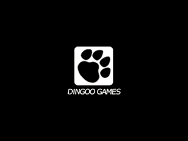 | ✅ Pass |
| Ali Baba | 阿里巴巴 | `tmp/dingoo_game/AliBaba.app` |  | ✅ Pass |
| Astro Lander | 星际着陆 | `tmp/dingoo_game/Astro-Lander/Astro-Lander.app` | 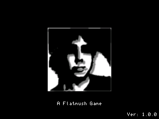 | ✅ Pass |
| Block Breaker | 打砖块 | `tmp/dingoo_game/Block Breaker.app` | 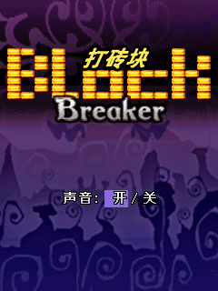 | ✅ L2 |
| Candy | 糖果 | `tmp/dingoo_game/Candy.app` | 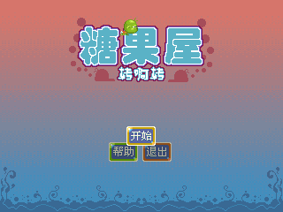 | ✅ Pass |
| Decollation Warrior | 斩首战士 | `tmp/dingoo_game/Decollation-Warrior.app` |  | ✅ Pass |
| Formula One | F1赛车 | `tmp/dingoo_game/Fomula-One.app` | 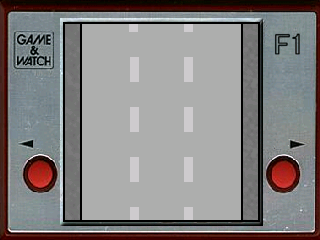 | ✅ Pass |
| GooPlayer | Goo播放器 | `tmp/dingoo_game/GooPlayer/GooPlayer.app` | 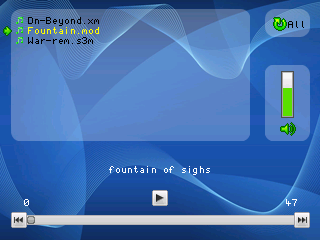 | ✅ L3 |
| Hell Striker II | 地狱打击者II | `tmp/dingoo_game/Hell Striker II.app` | 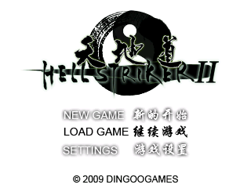 | ✅ Pass |
| Hexa-Virus | 六角病毒 | `tmp/dingoo_game/Hexa-Virus.app` | 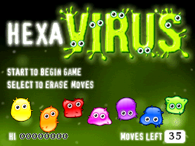 | ✅ Pass |
| Landlord | 地主 | `tmp/dingoo_game/Landlord.app` | 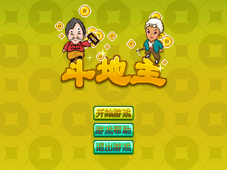 | ✅ Pass |
| Link'em Up | 连连看 | `tmp/dingoo_game/Link'em Up.app` |  | ✅ Pass |
| Manic Miner | 疯狂矿工 | `tmp/dingoo_game/Manic-Miner.app` | 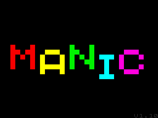 | ✅ Pass |
| Mine Sweeper | 扫雷 | `tmp/dingoo_game/Mine Sweeper.app` | 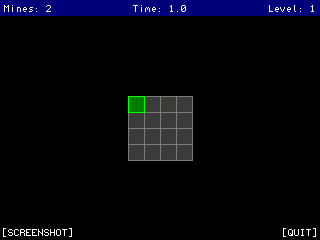 | ✅ L2 |
| Mushroom Roulette | 蘑菇轮盘 | `tmp/dingoo_game/Mushroom Roulette.app` | 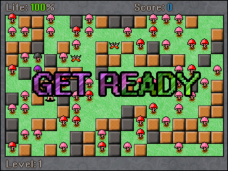 | ✅ Pass |
| Nose Breaker | 破鼻者 | `tmp/dingoo_game/Nose Breaker.app` |  | ✅ Pass |
| Overlord Fighter | 霸王战纪 | `tmp/dingoo_game/Overlord-Fighter.app` | 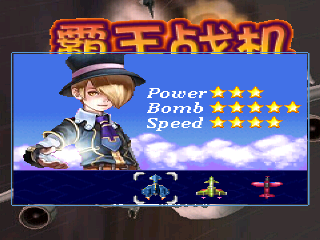 | ✅ Pass |
| Platinum Sudoku | 白金数独 | `tmp/dingoo_game/Platinum Sudoku.app` |  | ✅ L2 |
| Puzzle Bobble | 泡泡龙 | `tmp/dingoo_game/Puzzle Bobble.app` | 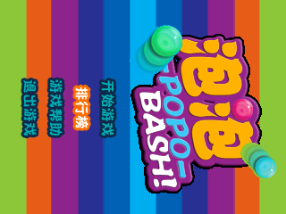 | ✅ L2 |
| Rick Dangerous | 里克危险 | `tmp/dingoo_game/Rick-Dangerous.app` | 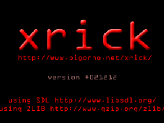 | ✅ Pass |
| Rubido | 鲁比多 | `tmp/dingoo_game/Rubido.app` | 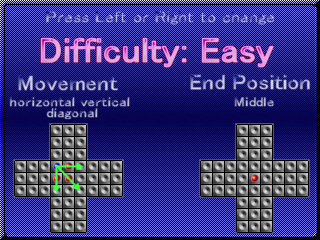 | ✅ L2 |
| SameGoo | 消消乐 | `tmp/dingoo_game/SameGoo/samegoo.app` | 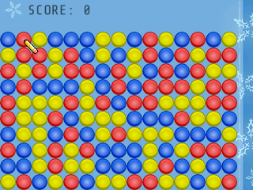 | ✅ L3 |
| Snake | 贪吃蛇 | `tmp/dingoo_game/Snake.app` | 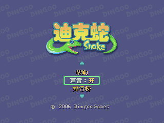 | ✅ L3 |
| Sokuban | 推箱子 | `tmp/dingoo_game/Sokuban/Sokuban.app` |  | ✅ L2 |
| Spoout | — | `tmp/dingoo_game/Spoout.app` | 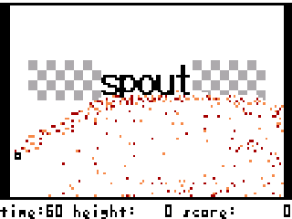 | ✅ Pass |
| StopWatch | 秒表 | `tmp/dingoo_game/StopWatch.app` | 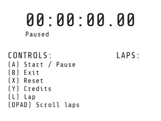 | ✅ L2 |
| Tetris | 俄罗斯方块 | `tmp/dingoo_game/Tetris.app` | 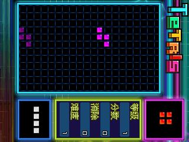 | ✅ L3 |
| Ultimate Drift | 极限漂移 | `tmp/dingoo_game/Ultimate Drift.app` | 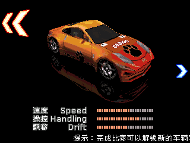 | ✅ L3 |
| Zero Gravity | 零重力 | `tmp/dingoo_game/Zero-Gravity.app` | 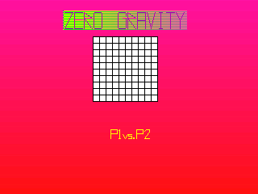 | ✅ Pass |
| Zhao-Chuan RPG | 赵传RPG | `tmp/dingoo_game/Zhao-Chuan RPG.app` | 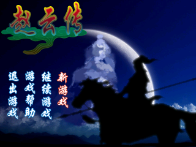 | ✅ Pass |
| Seven Nights | 七夜 | `tmp/dingoo_game/七夜.app` | 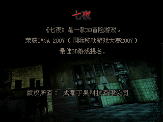 | ✅ Pass |
| Sword and Fairy | 仙剑奇侠传 | `tmp/dingoo_game/仙剑奇侠传/仙剑奇侠传.APP` |  | ✅ Pass |

## Status Legend

| Symbol | Meaning |
|--------|---------|
| ✅ L3 | Matches the configured non-silent PCM stream, format, and queue limits after passing L2. |
| ✅ L2 | Replays the configured input and matches its expected checkpoint. |
| ✅ Pass | Reaches L1; no higher-level scenario is configured yet. |
| ❌ Fail | Does not reach its configured level; inspect the recorded reason. |
